<div align="center">

# 🛒 Smart POS System

### **Enterprise-Grade Point of Sale Solution for Modern Retail**

[](https://react.dev/)
[](https://typescriptlang.org/)
[](https://expressjs.com/)
[](https://mysql.com/)
[](https://vite.dev/)
[](https://tailwindcss.com/)
[](LICENSE)

**A comprehensive, full-stack Point of Sale system designed for real-world retail operations.**  
Streamlines sales processing, real-time inventory tracking, customer loyalty management, and data-driven analytics — all in one unified platform.

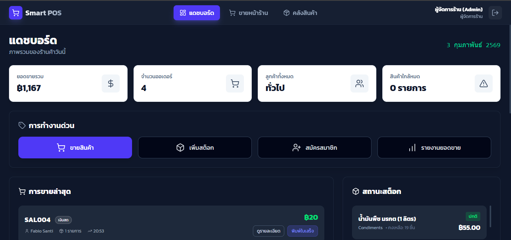

</div>

---

## 📋 Table of Contents

- [Key Features](#-key-features)
- [System Screenshots](#-system-screenshots)
- [Architecture Overview](#-architecture-overview)
- [Tech Stack](#-tech-stack)
- [Database Schema](#-database-schema)
- [API Endpoints](#-api-endpoints)
- [Project Structure](#-project-structure)
- [Getting Started](#-getting-started)
- [Default Credentials](#-default-credentials)
- [Usage Guide](#-usage-guide)
- [Contributing](#-contributing)
- [License](#-license)

---

## ✨ Key Features

| Module | Feature | Description |
|--------|---------|-------------|
| 🔐 **Authentication** | Role-Based Access Control | Separate **Admin** (Manager) and **Staff** (Cashier) privilege levels with protected routes |
| 💻 **POS Terminal** | Real-Time Checkout | Instant product search, quantity adjustment, multi-payment support (Cash / Transfer) |
| 👥 **Membership** | Loyalty Point System | Automated point accumulation (10 THB = 1 Point) with member search & registration |
| 📊 **Dashboard** | Analytics & Insights | Daily sales metrics, total revenue, order counts, and low-stock alerts at a glance |
| 📦 **Inventory** | Product Management | Full CRUD operations with category management, cost/price tracking, and stock monitoring |
| 🧾 **Receipts** | Digital Receipt Engine | Professional receipt generation with itemized details, taxes, and member point summary |
| ⭐ **Best Sellers** | Sales Intelligence | Real-time best-selling product rankings to support data-driven decisions |
| 📈 **Stock Alerts** | Proactive Monitoring | Automated low-stock detection with visual status indicators (In Stock / Low / Out) |

---

## 📸 System Screenshots

<table>
  <tr>
    <td align="center" width="50%">
      <strong>🔑 Login Interface</strong><br>
      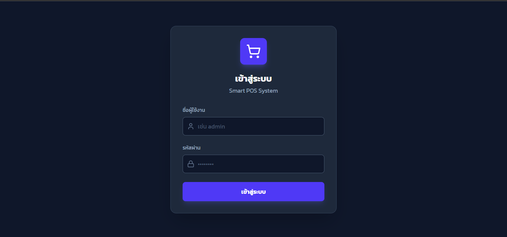<br>
      <em>Secure dark-themed authentication screen</em>
    </td>
    <td align="center" width="50%">
      <strong>📊 Dashboard</strong><br>
      <br>
      <em>Real-time analytics overview with KPIs</em>
    </td>
  </tr>
  <tr>
    <td align="center">
      <strong>💻 POS Terminal</strong><br>
      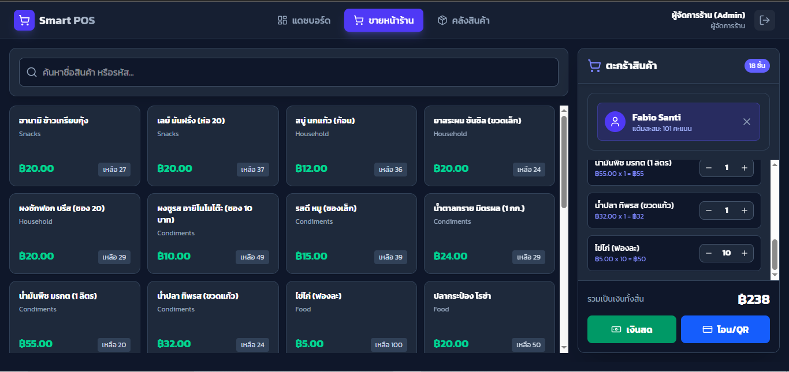<br>
      <em>Streamlined checkout interface</em>
    </td>
    <td align="center">
      <strong>📦 Inventory Management</strong><br>
      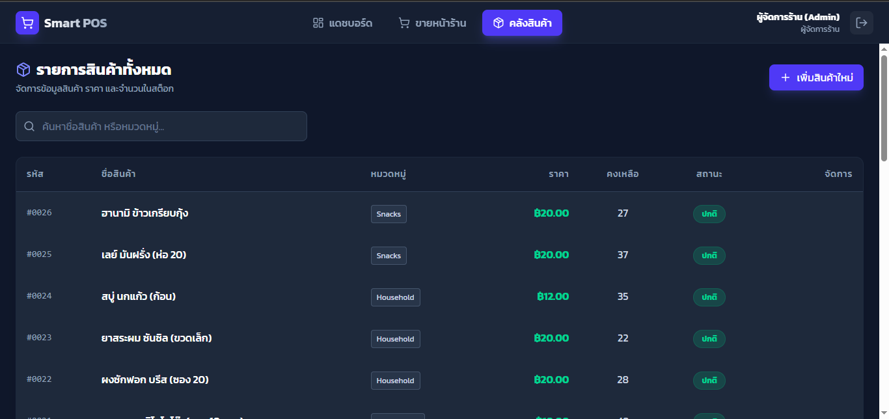<br>
      <em>Centralized product & stock management</em>
    </td>
  </tr>
  <tr>
    <td align="center">
      <strong>🧾 Digital Receipt</strong><br>
      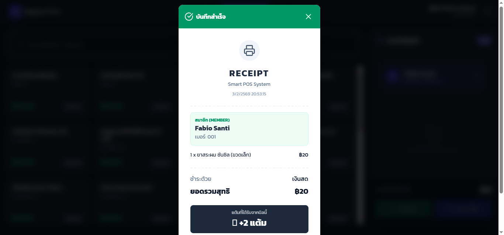<br>
      <em>Auto-generated receipt with transaction details</em>
    </td>
    <td align="center">
      <strong>🎖️ Member Receipt</strong><br>
      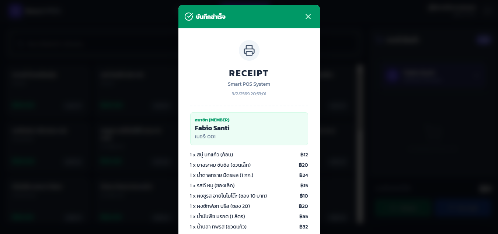<br>
      <em>Receipt with loyalty point accumulation</em>
    </td>
  </tr>
  <tr>
    <td align="center">
      <strong>⭐ Best Sellers</strong><br>
      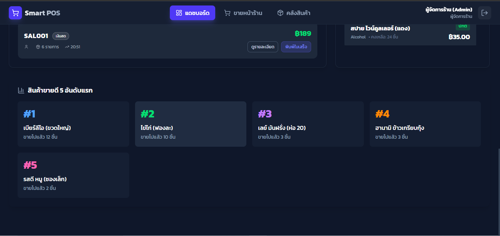<br>
      <em>Top-performing products analytics</em>
    </td>
    <td align="center">
      <strong>📈 Recent Sales & Stock Status</strong><br>
      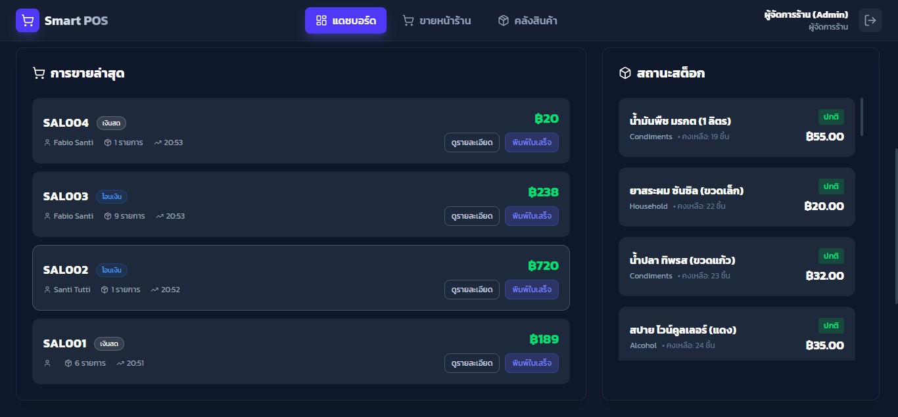<br>
      <em>Live transaction feed & stock alerts</em>
    </td>
  </tr>
</table>

---

## 🏗️ Architecture Overview

This project follows a **3-Tier Client-Server Architecture** with clear separation of concerns:

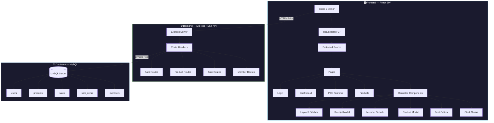

### Request Flow

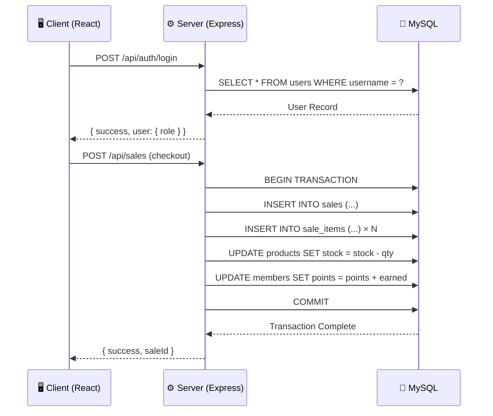

---

## 🛠️ Tech Stack

### Frontend

| Technology | Version | Purpose |
|------------|---------|---------|
| **React** | 19.2 | UI component library with latest concurrent features |
| **TypeScript** | 5.9 | Type-safe development with strict compilation |
| **Vite** (Rolldown) | 7.2 | Next-gen bundler for ultra-fast HMR & builds |
| **Tailwind CSS** | 4.1 | Utility-first CSS framework for rapid UI development |
| **React Router** | 7.13 | Client-side routing with protected route guards |
| **Axios** | 1.13 | Promise-based HTTP client for API communication |
| **Lucide React** | 0.563 | Beautiful, consistent icon library |
| **React Hot Toast** | 2.6 | Elegant notification system |

### Backend

| Technology | Version | Purpose |
|------------|---------|---------|
| **Node.js** | LTS | Server-side JavaScript runtime |
| **Express** | 5.2 | Minimal, flexible web framework |
| **TypeScript** | 5.9 | Type-safe server development |
| **MySQL2** | 3.16 | High-performance MySQL driver with connection pooling |
| **CORS** | 2.8 | Cross-origin resource sharing middleware |
| **dotenv** | 17.2 | Environment variable management |

---

## 💾 Database Schema

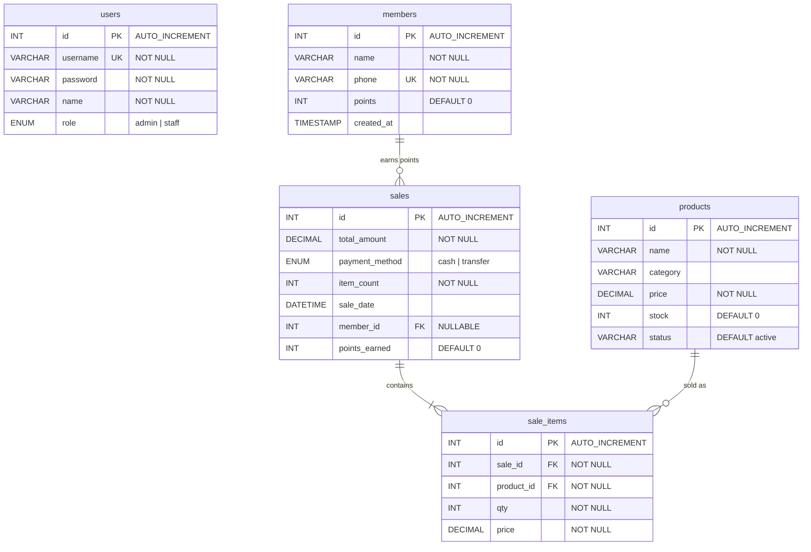

---

## 🔌 API Endpoints

### Authentication

| Method | Endpoint | Description | Access |
|--------|----------|-------------|--------|
| `POST` | `/api/auth/login` | Authenticate user & return role | Public |

### Products

| Method | Endpoint | Description | Access |
|--------|----------|-------------|--------|
| `GET` | `/api/products` | List all products | Admin, Staff |
| `POST` | `/api/products` | Create new product | Admin |
| `PUT` | `/api/products/:id` | Update product details | Admin |
| `DELETE` | `/api/products/:id` | Delete a product | Admin |

### Sales

| Method | Endpoint | Description | Access |
|--------|----------|-------------|--------|
| `POST` | `/api/sales` | Process checkout transaction | Admin, Staff |
| `GET` | `/api/sales/today` | Get today's sales summary | Admin |
| `GET` | `/api/sales/recent` | Get recent transactions | Admin |
| `GET` | `/api/sales/best-sellers` | Get top-selling products | Admin |

### Members

| Method | Endpoint | Description | Access |
|--------|----------|-------------|--------|
| `GET` | `/api/members/search` | Search member by phone | Admin, Staff |
| `POST` | `/api/members` | Register new member | Admin, Staff |

---

## 📁 Project Structure

```
Smart-Retail/
├── 📂 client/                          # Frontend Application
│   ├── 📂 src/
│   │   ├── 📂 assets/                  # Static assets (images, logos)
│   │   ├── 📂 components/              # Reusable UI Components
│   │   │   ├── BestSellers.tsx         #   ├─ Top-selling products widget
│   │   │   ├── Layout.tsx              #   ├─ App shell (sidebar + header)
│   │   │   ├── MemberSearch.tsx        #   ├─ Member lookup & registration
│   │   │   ├── ProductModal.tsx        #   ├─ Add/Edit product form modal
│   │   │   ├── QuickActions.tsx        #   ├─ Dashboard shortcut buttons
│   │   │   ├── ReceiptModal.tsx        #   ├─ Digital receipt generator
│   │   │   ├── RecentSales.tsx         #   ├─ Recent transactions table
│   │   │   └── StockStatus.tsx         #   └─ Stock level indicators
│   │   ├── 📂 data/                    # Static/mock data
│   │   ├── 📂 pages/                   # Route Pages
│   │   │   ├── Dashboard.tsx           #   ├─ Analytics & overview
│   │   │   ├── Login.tsx               #   ├─ Authentication page
│   │   │   ├── POS.tsx                 #   ├─ Point of Sale terminal
│   │   │   └── Products.tsx            #   └─ Inventory management
│   │   ├── 📂 services/               # API service layer (Axios)
│   │   ├── App.tsx                     # Root component + routing
│   │   ├── App.css                     # Global styles
│   │   ├── index.css                   # Tailwind directives
│   │   └── main.tsx                    # Application entry point
│   ├── index.html                      # HTML template
│   ├── vite.config.ts                  # Vite build configuration
│   ├── tailwind.config.js              # Tailwind CSS configuration
│   ├── tsconfig.json                   # TypeScript configuration
│   └── package.json
│
├── 📂 server/                          # Backend Application
│   ├── 📂 src/
│   │   ├── 📂 config/
│   │   │   └── db.ts                   # MySQL connection pool setup
│   │   ├── 📂 routes/
│   │   │   ├── authRoutes.ts           #   ├─ Login & authentication
│   │   │   ├── productRoutes.ts        #   ├─ Product CRUD operations
│   │   │   ├── saleRoutes.ts           #   ├─ Sales & analytics queries
│   │   │   └── memberRoutes.ts         #   └─ Member search & registration
│   │   └── index.ts                    # Express app bootstrap
│   ├── database.sql                    # Database schema & seed data
│   ├── .env.example                    # Environment variable template
│   ├── tsconfig.json                   # TypeScript configuration
│   └── package.json
│
├── 📂 screenshots/                     # Application screenshots
└── README.md                           # This file
```

---

## 🚀 Getting Started

### Prerequisites

Ensure you have the following installed:

| Tool | Version | Download |
|------|---------|----------|
| **Node.js** | ≥ 18.x | [nodejs.org](https://nodejs.org/) |
| **MySQL** | ≥ 8.0 | [mysql.com](https://dev.mysql.com/downloads/) |
| **npm** | ≥ 9.x | Bundled with Node.js |

### Step 1 — Clone the Repository

```bash
git clone https://github.com/Yom1nr/Smart-Retail.git
cd Smart-Retail
```

### Step 2 — Database Setup

```bash
# Login to MySQL
mysql -u root -p

# Inside MySQL shell, run:
SOURCE server/database.sql;
```

This will create the `smart_pos` database with all required tables and seed data (default admin/staff users).

### Step 3 — Backend Configuration

```bash
cd server
npm install
```

Create a `.env` file from the example template:

```bash
cp .env.example .env
```

Configure your database credentials in `.env`:

```env
DB_HOST=localhost
DB_USER=root
DB_PASSWORD=your_password_here
DB_NAME=smart_pos
PORT=3000
```

Start the backend server:

```bash
npm run dev
```

> ✅ Server will be running at `http://localhost:3000`

### Step 4 — Frontend Setup

Open a **new terminal** and run:

```bash
cd client
npm install
npm run dev
```

> ✅ Frontend will be available at `http://localhost:5173`

---

## 🔑 Default Credentials

| Role | Username | Password | Access Level |
|------|----------|----------|--------------|
| 🛡️ **Manager** (Admin) | `admin` | `1234` | Full Access — Dashboard, Inventory, POS |
| 👤 **Cashier** (Staff) | `staff` | `1234` | Restricted — POS Terminal Only |

> [!CAUTION]
> **Security Notice:** These are development credentials only. Change all default passwords immediately before deploying to production.

### Role-Based Access Matrix

| Feature | Admin ✅ | Staff ✅ |
|---------|---------|---------|
| Dashboard & Analytics | ✅ | ❌ |
| POS Terminal | ✅ | ✅ |
| Inventory Management | ✅ | ❌ |
| Member Registration | ✅ | ✅ |
| View Reports | ✅ | ❌ |

---

## 📖 Usage Guide

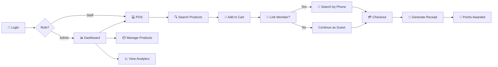

1. **Login** — Authenticate with your assigned role (Admin or Staff).
2. **Dashboard** *(Admin only)* — Review daily KPIs: total sales, order count, revenue, and low-stock alerts.
3. **POS Terminal** — Search products → Add to cart → Adjust quantities → Link member (optional) → Select payment method → Complete checkout.
4. **Receipt** — Automatically generated after each transaction with full itemized details and member points.
5. **Inventory** *(Admin only)* — Add new products, update pricing/stock, or archive discontinued items.
6. **Membership** — Search members by phone number or register new ones. Points accumulate automatically at checkout.

---

## 🤝 Contributing

Contributions are welcome! Please follow these steps:

1. **Fork** the repository
2. **Create** a feature branch: `git checkout -b feature/amazing-feature`
3. **Commit** your changes: `git commit -m 'feat: add amazing feature'`
4. **Push** to the branch: `git push origin feature/amazing-feature`
5. **Open** a Pull Request

> [!TIP]
> Follow [Conventional Commits](https://www.conventionalcommits.org/) for commit messages.

---

## 📝 License

This project is licensed under the **MIT License**. See the [LICENSE](LICENSE) file for details.

---

## 👨‍💻 Author

**Developed by [Yom1nr](https://github.com/Yom1nr)**

---

<div align="center">

**⭐ If you found this project useful, please give it a star! ⭐**

</div>
